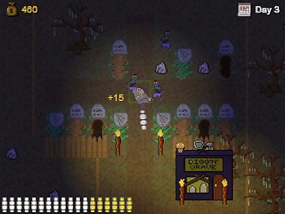
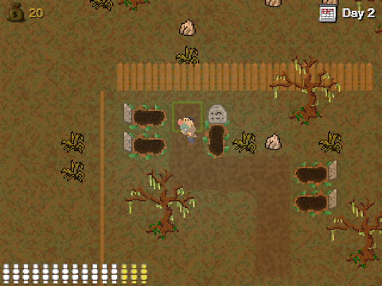
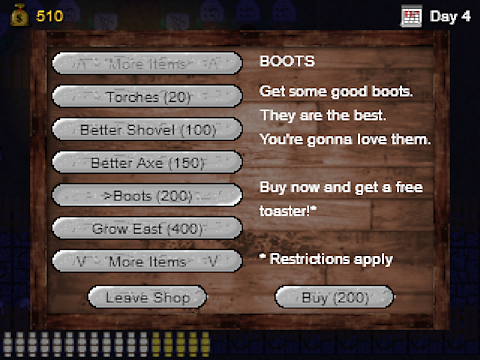

# Welcome to “Grave Heart”, the cozy local cemetery!

A place where you’ll find many dead people. **Too many** I should rather say because space is tight and new bodies are arriving constantly.

Oh, and then there is Hans! He’s not dead. Well maybe a little on the inside – dealing with corpses 24/7 can make you a little… numb.

So why don’t you help him? All you gotta do is bury all the deceased before too many of them start piling up!

By the way – did we mention that you might encounter an occasional **zombie**?! If that doesn’t get you on board right now we don’t know what will!

## What are you waiting for? Go dig in!

The game is written as an **HTML5 browser application so you don’t even have to install anything!** Well… apart from a browser, which you obviously have. Lucky you!

Here are the best ways to experience the game:

- **[Directly playable browser game](http://shellfishgames.com/games/graveheart/index.html) – this is what you want in most cases**
- [Downloadable version](http://shellfishgames.com/dl/graveheart.zip) – if you prefer playing locally or offline
- [Source code](https://github.com/m2u-84/ldjam42) – if your inner coding geek can’t resist it

The interface is controlled via a few keyboard buttons. To make things even easier for you we included an **in-game tutorial**. So dive right in!

## The team

A few words about us: We are a group of six people working in various IT positions in Germany. Rather spontaneously we decided that you can’t really call yourself a proper nerd without having tried to write your own little video game. Now it’s up to you to decide how good that idea was!

In detail we are:

- **Kevin-Alexander Grewe**  
(coding, design)
- **Bastian Lang**  
(coding)
- **Ranjit Mevius**  
(coding, sounds)
- **Markus Over**  
(initiator, coding, design)
- **Jenny van Veen**  
(design, storyboard, playtesting)
- **Matthias Wetter**  
(music, voices, sounds, design)

## Disclaimer

We tried to create everything included in this work on our own. That means the pictures you see, the music and voices you hear, and the overall gameplay etc. have been crafted by us within the given 72 hours.

Just a few audio takes that we recombined to form more complex soundscapes have been taken from sites like [Freesound](https://freesound.org/). The few external sources we made use of are all providing these contents under **CC0 license**.

## Acknowledgments

Our **special thanks** go out to:

- all the people behind Ludum Dare for organizing this great event
- ip.labs for providing free coffee and enough space (haha, noticed that little pun we smuggled in here?)
- **and you of course** for taking the time to read all this and test our little game. Much appreciated!
